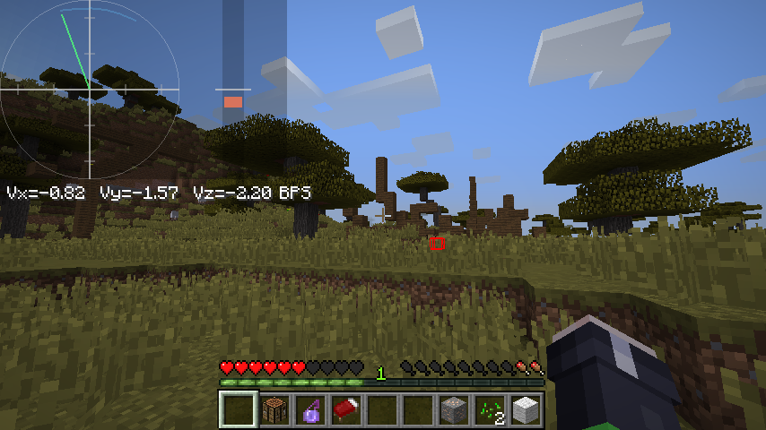

# Velocity Tracker

`1.8.9-forge-mod`

Render the player’s three-dimensional velocity data onto the screen within a coordinate system.

## Commands

### `/velocitytracker <option>`

- `toggle`
- `scale <value>`
- `alpha <value>`
- `graphsize <value>`
- `posx <value>`
- `poxy <value>`
- `vyrange <value>`